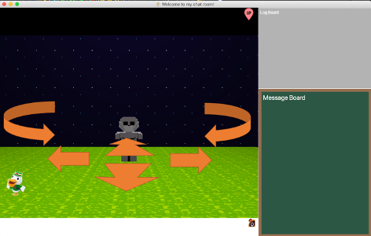
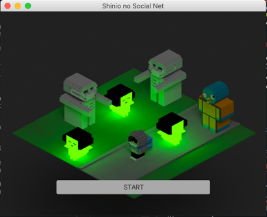
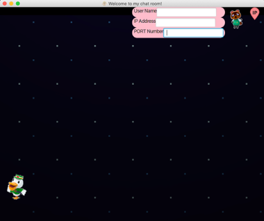
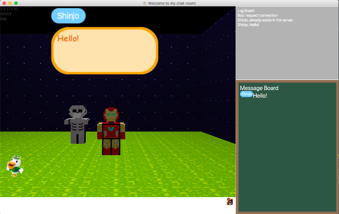

# New design of Social Network Service

University of Birmingham 

Shinjo Sato

## Introduction
The application will become like a social network service such as Facebook. The characteristic will be that not only chat with others but also handle an avatar and hang around the 3d graphic world. This is not my thesis but my private project.

## Chance to do this Project

When I started creating this app on 27th March 2020, people in the globe cannot go outside except a few situations because of COVID-19. Under the situation, people need the way to communicate with each other, so that’s why I make use of what I have learned in University and introduce the way.

## Difference between other SNS

In this app, people can handle the main character with the keyboard; communicate by texting when connecting the server. On famous social network services such as Twitter, Facebook and LINE, texting is the mainstream to communication. But, in the future, visual technology like VR or AR will be more developed and common, so I add texting with visualization to the application. By adding
visuality, people can communicate not only by texting but also the character’s movement. User can move back and forth, left and right and turn left and right.
 
## Progress

I have tested one-to-one communication by using my laptop as a client and Amazon Lightsail as a server. First I execute the server, second execute two client programs in parallel, third enter the server’s IP address and the port number on each client programs and connect to the server if both the IP address and the port number are correct.
## Set up
1. Launch the application.

    

    When executing the main file, the main window appears on the screen, then you can start the application by pushing the start button on the window.

2. Open the main screen

    

    When starting the application, 3d graphics appear and you can move the main character and a camera. By pushing some key buttons, some of the user interfaces appear on the window. In this situation, you can handle your avatar.

3. Connect to the server

    On the left top of the window, there are three text-fields and you can input user name, IP address and port number. If the pair of the IP address and port number is the same with those of prepared server, you can permit to connect it.

   - If there are already other users connecting to the server, their main characters appear on your screen then they move by users' manipulation.

## Communication with others

If you and other users connect to the server, you can chat with each other.

- Speech bubble

  When you write and send a message, the speech bubble appears above your main character such as cartoons, then other users can see it. For example, on the above picture, Shinjo send “Hello!” to the server, the server distributes it to other users then the message appears.

- Chatting by board

  On the bottom right side of the window, there is a board, which shows users' messages. For example, in the above picture, the message from Shinjo is shown.