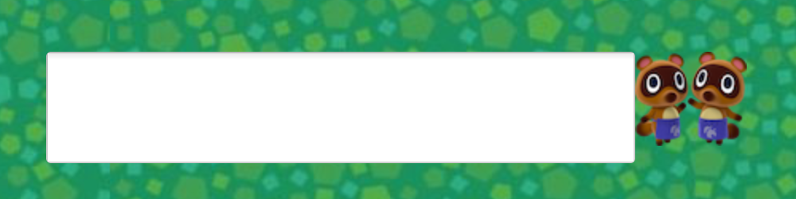

#  :hatched_chick: :girl: Welcome to my Neo Sorcial Network Service!! :boy: :rooster:

## Data

- Author・・・　Shinjo Sato

- Version・・・1.0

- Date・・・2020-04-01

- Language・・・Java

- IDE・・・Eclipse

- Framework, Library・・・JavaFX

- Tools・・・Git

- OS・・・Mac OS

## Overview

### Moving an avatar

After launching this application, we can see the chatacter on the centre of the window, which is an avatar of the user, and we can manipulate it by cursor movement key.

### Connecting a server

In this application, users can communicate with each other by texting and moving our avatars.

First, before playing this app, we need to connect the same server. At the top right of the screen, we can see IP address icon. When user push the icon, a raccoon and three input areas: user name, IP address and Port number are appears on the left side of the icon, then push it again, these areas disappear.

After filling in these input area appropriate then pushing the raccoon, users can connect the server and rename the avatar, then these areas disappear, which never show up　even if users push the icon again, and a mole with ip address and user name appear on the right side of the window.

### Texting (with friends)

On the bottom of the window, as you can see, there are twin raccoon. By clicking this character icon, the text field is appear on the left side and user can input texts.

By pushing the enter button, users can send the server a message then Log Board, Message Board and a bubble speech on the avatar are updated. If there were other users on the same server, their screen are updated on the same time.

When pusshing the character again, the textarea will disappear.